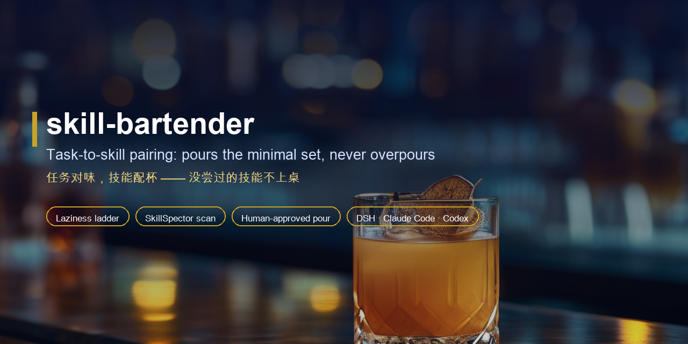
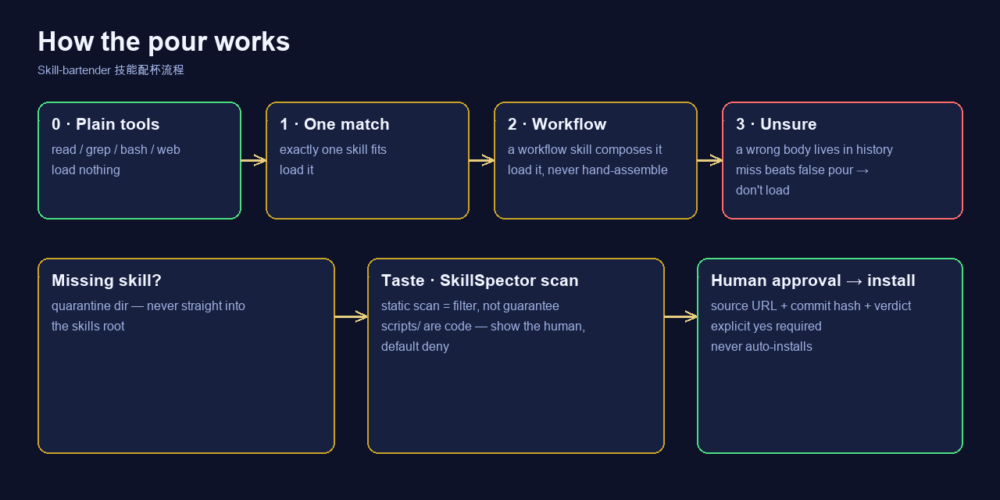

<div align="center">



<br>

# 🍸 skill-bartender

### *任务对味，技能配杯 —— 没尝过的技能不上桌。*

[](../../LICENSE)
[](https://github.com/akqwpeter-prog/skill-bartender/actions/workflows/scan.yml)
[](https://github.com/topics/dsh-plugin)
[](../skillspector-report.json)
[](../../README.md#-quick-start)

<br>

你的 agent 已经能看到技能目录（名字+一句话描述），但它常常「倒多了」：
一次加载一堆技能、加载错的那个、或漏掉那条本就编排好一切的 workflow 技能。
**skill-bartender** 就是修这件事的元技能：

- 🪜 **懒人阶梯** — 通用工具能干的零加载；恰好匹配的只加载一个；组合任务用
  workflow 技能，不手工拼原子技能；拿不准就不加载。
- 🍷 **路由表** — 任务→技能映射写在 `references/policy.md`，随你改，覆盖默认规则。
- 🔐 **安全酒窖** — 需要但没装的技能：隔离区 → SkillSpector 扫描 → **人工确认**
  → 才拷进技能目录。永不自动安装。
- 🧠 **学习** — 加载了没用上的技能会被记下来，下次同类任务跳过。
- 🧪 **品鉴** — 随时审计已装技能，把含糊的描述重写成「何时用」一句话。

[为什么](#-为什么) · [能做什么](#-能做什么) · [快速开始](#-快速开始) · [效果演示](#-效果演示) · [用法](#-用法) · [安全模型](#-安全模型必读) · [FAQ](#-faq) · [示例](#-示例) · [目录结构](#-目录结构) · [许可证](#-许可证)

[**English**](../../README.md) · [**简体中文**](README_ZH.md)

</div>

---

## 🤔 为什么

大多数 agent 把技能目录当自助餐。`skill-bartender` 把它当成一家要先品鉴的吧台：

| | skill-bartender | 常规目录行为 |
|---|---|---|
| 每个任务加载的技能数 | 通常**一个**；工具能干的零加载 | 匹配到多少算多少 |
| Workflow 技能 | ✅ 优先，绝不手工拼原子技能 | ❌ 常被漏掉或手拼 |
| 拿不准匹配 | ❌ 不加载（漏判好过误判） | ⚠️ 「以防万一」先加载 |
| 安装缺失技能 | 🔐 隔离 → 扫描 → **人工批准** | ⚠️ 直接下载进技能目录 |
| 自动安装 | ❌ 设计上禁止 | ⚠️ 常常静默发生 |
| 学习 | ✅ 记下闲置加载，下次跳过 | ❌ 没有记忆 |

**为什么是「懒人阶梯」？** 加载错的技能正文会永远留在对话历史里；漏加载一次
只损失一次工具往返。最好的加载是没发生的加载（精神来源：
[ponytail](https://github.com/DietrichGebert/ponytail)）。

## ✨ 能做什么

| 能力 | 做什么 | 平台 |
|---|---|---|
| 🪜 懒人阶梯 | 停在第一个站稳的阶梯：0 工具够用 → 1 单个匹配 → 2 workflow 技能 → 3 拿不准不加载 | 全平台 |
| 🍷 路由表 | `references/policy.md` 任务→技能映射；URL 家族（doc/drive/wiki/sheets/base/slides）按路径模式路由 | 全平台 |
| 🔐 安全酒窖 | 缺技能：搜索 → **隔离区** → SkillSpector 扫描 → 脚本给人看（默认拒绝）→ 明确同意 → 安装；记录来源+commit+结论 | DSH / Claude Code / Codex |
| 🧠 学习 | 闲置加载记入日志，同类任务下次跳过；长期不用的技能建议移除 | DSH |
| 🧪 品鉴 | 按需审计已装技能，把弱描述重写成触发短语（目录 500 字上限内） | 按需 |

## ⚡ 快速开始

一个文件，三个平台：

```sh
# DeepSeek Harness
mkdir -p ~/.dsh/skills/skill-bartender
cp skills/skill-bartender/SKILL.md ~/.dsh/skills/skill-bartender/
cp -r skills/skill-bartender/references ~/.dsh/skills/skill-bartender/

# Claude Code
mkdir -p ~/.claude/skills/skill-bartender
cp skills/skill-bartender/SKILL.md ~/.claude/skills/skill-bartender/

# Codex
mkdir -p ~/.codex/skills/skill-bartender
cp skills/skill-bartender/SKILL.md ~/.codex/skills/skill-bartender/
```

或者作为 DSH bundle 安装：

```sh
dsh plugin --profile web add github:akqwpeter-prog/skill-bartender
```

然后说一次「skill-bartender」，或把路由表粘进 AGENTS.md 常驻生效。
完整示例见 [docs/EXAMPLES.md](../EXAMPLES.md)。

## 📸 效果演示

*配杯流程一图流：停在第一个站稳的阶梯；没尝过的技能绝不上桌。*



## 🚀 用法

| 方式 | 怎么做 | 何时用 |
|---|---|---|
| **A. 点名** | 会话里说「skill-bartender」 | 一次性或首次配置 |
| **B. 常驻路由** | 把路由表粘进 AGENTS.md | 每个任务都走阶梯 |
| **C. 点单** | 「这个任务该用哪个技能？」 | 在技能间做选择 |
| **D. 酒窖盘点** | 「审计一下我装了的技能」 | 品鉴：弱描述会被重写 |

`skill-bartender` 自身必须被加载一次（用户点名或任务匹配）——它不会自我触发，
也从不「以防万一」预加载。

## 🔐 安全模型（必读）

- 技能是**指令**，指令可能是对抗性的（提示注入）。SkillSpector 是**过滤器，
  不是保证**。
- 任何技能里的 `scripts/` 是**代码** —— 未经人工审查绝不执行。
- 每次安装都强制人工批准。**绝无静默安装。**
- 本技能自检干净：SkillSpector **0 findings**（score 0 / SAFE）——
  [docs/skillspector-report.json](../skillspector-report.json)。
- 安全策略：[SECURITY.md](../../SECURITY.md)。

## ❓ FAQ

**会自动安装缺失技能吗？**
不会。每次下载先进隔离区、过 SkillSpector 扫描，只有明确人工批准后才拷进
技能根目录。扫描通过只是过滤器不是保证——静态扫描拦不住提示注入，所以脚本
一律给人看、默认拒绝。

**没装 SkillSpector 怎么办？**
`uv tool install git+https://github.com/NVIDIA/skillspector.git`，或者走
`references/policy.md` 里的手工检查清单。

**能在 Claude Code 和 Codex 用吗？**
能——同一个 SKILL.md 三个平台约 15 秒装完。

**和 DshMarket / dsh-find-plugin / dsh-plugin-autoevo 有什么区别？**
它们负责发现、搜索、自动安装插件；skill-bartender 补上**路由策略**（阶梯+路由表）
和**先隔离后批准**的纪律。和生态**并用**，而不是替代。

**怎么评估它？**
路由策略自带 gold-task 套件：[docs/eval.md](../eval.md)。

## 🎁 示例

- [docs/EXAMPLES.md](../EXAMPLES.md) — 真实路由案例、酒窖安装、审计。
- [docs/ROUTING-GUIDE.md](../ROUTING-GUIDE.md) — 怎么写自己的任务→技能规则。
- [docs/eval.md](../eval.md) — 路由策略 gold-task 套件。

## 🗺️ 目录结构

```
skill-bartender/
├── skills/
│   └── skill-bartender/
│       ├── SKILL.md             # 技能本体（一个文件，三平台）
│       └── references/policy.md # 可编辑的路由表
├── docs/
│   ├── screenshots/how-it-works.png
│   ├── eval.md                  # gold-task 套件
│   ├── EXAMPLES.md / ROUTING-GUIDE.md
│   ├── skillspector-report.json # 自检：0 findings
│   ├── social-preview.png       # banner（scripts/ 重新生成）
│   └── lang/README_ZH.md        # 简体中文
├── scripts/
│   ├── make-banner.py           # 合成 docs/social-preview.png
│   ├── make-diagram.py          # 合成流程图
│   └── validate.py              # 本地结构校验
├── cordis.patch.yml / index.js / package.json   # DSH bundle 清单
└── LICENSE (MIT)
```

## 🤝 加入 DSH 插件生态

DeepSeek Harness 开发者预览版仍处于 Harness 开发者测试阶段；核心插件与基础
API 会持续迭代。期待与全球开发者在开源、开放、可复用、可组合的基础设施之上
共同探索智能的上限。

- [dsh-plugin topic](https://github.com/topics/dsh-plugin)
- [快速开始](https://deepseek-harness.github.io/deepseek-harness/guide/quickstart)
- [DeepSeek Harness 仓库](https://github.com/deepseek-ai/deepseek-harness)
- 配套执行器：[dsh-skill-router](https://github.com/akqwpeter-prog/dsh-skill-router)

> 本仓库已标记 [`dsh-plugin`](https://github.com/topics/dsh-plugin)，收录于
> [awesome-dsh-plugin](https://github.com/awesome-dsh-plugin/awesome-dsh-plugin)
> 精选列表。欢迎 PR、issue 与翻译。

## 📄 许可证

[MIT](../../LICENSE)。引用（而非打包）ponytail（MIT）——致谢写在 SKILL.md 里。
